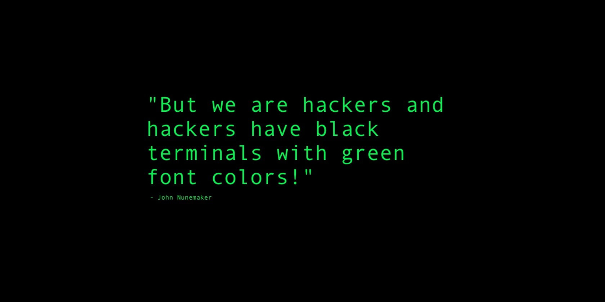

Hello, I'm **Chris**!

I am a passionate cybersecurity enthusiast, and I love working with Linux. I have experience with various Linux distributions including **Ubuntu**, **Debian**, **Arch**, and **Linux Mint**. I am also skilled in **Bash scripting** and constantly learning new things to improve my technical abilities.

## 🎓 Education:
- I’m currently pursuing my **Associate of Science in Cybersecurity** at **St. Petersburg College**.
- I was recently inducted into **Phi Theta Kappa Honor Society** to recognize my academic achievements.

## 💻 What I Do:
- **Cybersecurity Analyst (in training)**: Focused on securing systems, identifying vulnerabilities, and mitigating potential threats.
- **Linux Enthusiast (over 10 years experience)**: Working with Linux distributions to enhance my system administration and development skills.
- **Penetration Testing (in training)**: Learning ethical hacking and penetration testing methodologies to improve security.

## 📚 What I'm Learning:
- **Cybersecurity**: Diving deeper into network security, ethical hacking, and exploitation techniques.
- **Bash Scripting**: Improving my scripting skills to automate tasks and enhance system efficiency.
- **Networking**: Understanding TCP/IP, protocols, and network security.

## 🛠️ Tech Stack:
- **Linux** (Ubuntu, Debian, Arch, Linux Mint)
- **Cybersecurity** (Penetration Testing, Vulnerability Analysis)
- **Bash Scripting**

## 📫 How to reach me:
- **Email**: [chrisgarey2014@gmail.com](mailto:chrisgarey2014@example.com)
- **LinkedIn**: [Cosmo's LinkedIn](https://www.linkedin.com/in/chris-garey/)
- **GitHub**: [@cosmo](https://github.com/cgarey2014)

