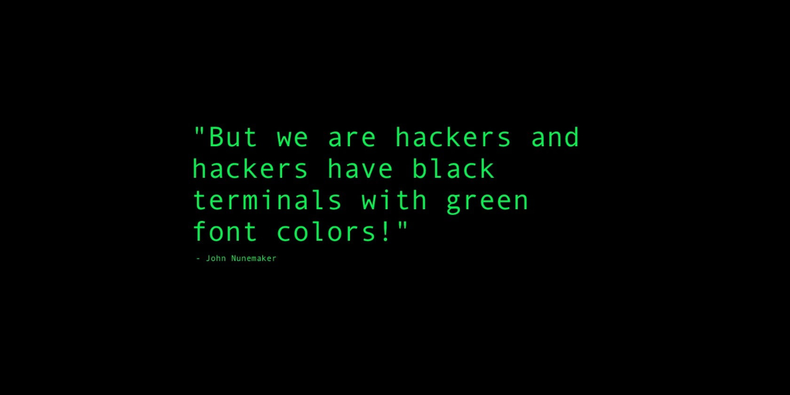

# `chris@cgarey2014:~$` whoami

### Cybersecurity · Linux · Firmware tinkering

`Pinellas, FL` &nbsp;·&nbsp; `St. Petersburg College — A.S. Cybersecurity` &nbsp;·&nbsp; `CompTIA Network+ (in progress)`

---

## 🔐 What I do

- **Cybersecurity, in training and in practice** — securing systems, finding vulnerabilities, and closing them. Currently studying for my A.S. in Cybersecurity at St. Petersburg College.
- **Linux, 10+ years** — Ubuntu, Debian, Arch and Mint. Comfortable in the shell, in config files, and in a machine that will not boot.
- **Network troubleshooting** — from a dead link to a DNS answer that goes to the wrong place. If it is supposed to talk to something and does not, I want to know which layer broke it.
- **Firmware and hardware** — flashing, recovering and rewriting the firmware on my own security hardware, microcontrollers and all.
- **Bash scripting** — because the second time I do something by hand, it should have been a script the first time.

## 🧰 IT experience

| area | what that looks like in practice |
|---|---|
| **Linux systems** | 10+ years across Ubuntu, Debian, Arch and Mint — installs and re-installs, package and dependency breakage, drivers, permissions and users, storage, and boot loaders that stopped cooperating |
| **Shell and scripting** | Bash for automation: repetitive fixes become one-liners, then scripts, then something I forget about until it saves me an afternoon |
| **Networking** | TCP/IP, addressing and subnetting, switching and routing basics, DNS, DHCP, wireless. Reading a packet capture to find out what *actually* happened instead of what should have |
| **Hardware and firmware** | Microcontrollers (ESP32 family), serial and USB debugging, flashing devices over the wire, and recovering ones that will not come up |
| **Security work** | Wireless surveying, packet capture and review, vulnerability scanning, log review, and hardening what I find |

## 🔎 How I troubleshoot network and technical problems

The short version: **find the layer, prove it, and only then change something.**

1. **Reproduce it and write down what "broken" means.** "The network is down" is not a symptom. "This host cannot resolve that name but can ping the IP" is.
2. **Work the stack in order** — physical and link, then addressing and routing, then name resolution, then the application. A cable or a dead access point explains more outages than anything clever does, and it is the fastest thing to rule out.
3. **Change one variable at a time.** Two changes at once means I have learned nothing about which one mattered.
4. **Read the logs before guessing.** `journalctl`, `dmesg`, `ip a`, `ip route`, `ss`, `tcpdump`. The device is usually already explaining itself.
5. **Bisect when it is complicated.** Halve the path, test, and repeat until the break is undeniable — then fix that and only that.
6. **Prove the fix with the smallest test that fails before it and passes after it.** "It works now" is not evidence; something that failed a minute ago and passes now is.
7. **Write it down.** The note I take on the third time I hit the same problem is the one that becomes a script.

For firmware, the same loop just moves down a level: confirm it is really the firmware, flash the smallest change, keep the serial console open, and check the flash layout before blaming the code.

## ⚡ Vibe coding firmware

I love **vibe coding new firmware for my cybersecurity devices** — taking a device I already own, working out how its display, radios and storage actually fit together, and then rebuilding the parts that annoy me: fitting text to a small screen, a theme that is actually readable, a boot screen with some personality.

The one on GitHub right now is **[Marauder Mini v3 — Cyberpunk Edition](https://github.com/cgarey2014/marauder-cyberpunk-edition)**: a neon retheme and 128 px text-fitting rebuild of the ESP32 Marauder firmware for the ESP32-C5 Mini v3, plus a browser flasher to install it. It is a fork of [justcallmekoko's ESP32 Marauder](https://github.com/justcallmekoko/ESP32Marauder) — his work, my paint.

## 🎓 Education and credentials

- **A.S. in Cybersecurity** — St. Petersburg College *(in progress)*
- **Phi Theta Kappa Honor Society** — inducted for academic achievement
- **CompTIA Network+** — studying *(in progress)*

## 🛠️ Tech stack

## 📊 Stats

 

## 📫 How to reach me

<code>root@localhost:~# stay curious · break it in the lab · document the fix</code>

